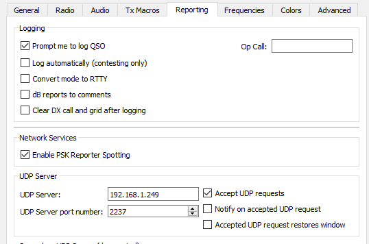

# What is wsjtx-dx-alert

_wsjtx-dx-alert_ is a custom Python module that I have developed to assist with providing notifications upon successful decodes from the WSJTX software.

The intention was to be able to leave WSJTX running on my PC while monitoring the 2m or 6m band and then have a message sent to my phone if something interesting has been seen
which could include DX or just a new call sign that I've not managed a QSO with.

The _wsjtx-dx-module_ is intended to run as part of a larger setup which is summarised as follows:

WSJTX -> wsjtx-dx-alert -> MQTT -> Node-RED -> Telegram Bot

First of all, the WSJTX software should be configured to send status updates to the system running the _wsjtx-dx-module_. An example of my own system is shown in the screenshot below
where I have specified the UDP server as _192.168.1.249_.

When the wsjtx-dx-alert module receives messages from WSJTX, it will handle them based on whatever has been defined in the configuration file (_settings.yaml_). For example, I could
create a configuration so that I only receive messages to my phone if a station more than 1000 miles away has been decoded. If there are stations which meet these requirements then
_wsjtx-dx-alert_ will send a message to the MQTT broker with the callsign informathttps://mosquitto.org/ion.

The MQTT broker that I use is _Mosquitto_ <https://mosquitto.org> and I run it on the same system running _wsjtx-dx-alert_. On a Debian based system this can be installed as follows:

apt-get install mosquitto\
sudo systemctl enable mosquitto.service
sudo systemctl start mosquitto.service

Node-RED should also be installed which basically pulls the messages from _Mosquitto_ and sends them onto a _Telegram_ bot as shown by the following screenshot.
In this example, I'm receiving messages when stations of over 1000 miles have been seen.

![Telegram 40m DX][images/wsjtx-dx-alert-Telegram.png]

I'll continue updating things as I use this myself over the next few months on 2m and 6m. Feel free to get in touch with questions/ideas etc._

